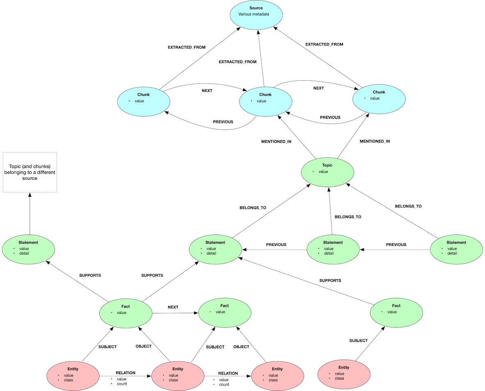

[[Home](./)]

## Graph Model

### Topics

  - [Overview](#overview)
    - [Changes in v2.x](#changes-in-v2x)
    - [A three-tiered lexical graph](#a-three-tiered-lexical-graph)
    - [Units of context](#units-of-context)
  - [Lineage tier](#lineage-tier)
  - [Entity-Relationship tier](#entity-relationship-tier)
  - [Summarisation tier](#summarisation-tier)
    - [Facts](#facts)
    - [Statements](#statements)
    - [Topics](#topics)

### Overview

The graphrag-toolkit uses a form of hierarchical [lexical graph](https://graphr.ag/reference/knowledge-graph/lexical-graph-hierarchical-structure/), auto-generated from unstructured sources, whose job is to help question-answering systems retrieve information which is *semantically dissimilar from the question*, but nonetheless *relevant to the answer*.

#### Changes in v2.x

The graphrag-toolkit's graph model has changed with v2.x of the toolkit. All node labels and relationship names are now surrounded by double underscores. For example, v1.x `Entity` nodes are now `__Entity__`. The reason for this change is to better allow the lexical graph data to co-exist with domain-specific data.

#### A three-tiered lexical graph

The lexical graph has three tiers:

  - [**Lineage**](#lineage-tier) - Sources, chunks, and the relations between them.
  - [**Summarisation**](#summarisation-tier) - Hierarchical summarisations and lexical units at different levels of granularity.
  - [**Entity-Relationship**](#entity-relationship-tier) - Individual entities and relations extracted from the underlying sources.
  

  
#### Units of context

When using a lexical graph in a RAG application, the question arises: what size lexical unit should form the basis of the context?

For many RAG applications, the primary unit of context is the *chunk*: that is, the context window is formed of one or more chunks retrieved from the corpus. Different chunking strategies produce differently sized chunks: there's no one-size-fits-all definition of a chunk. For the purpose of this documentation, however, we take a chunk to be something larger than an individual sentence, but smaller than an entire document.

For the graphrag-toolkit, the primary unit of context is not the chunk, but the *statement*, which is a standalone assertion or proposition. Source documents are broken into chunks, and from these chunks are extracted statements. Statements are thematically grouped by topic, and supported by facts. At question-answering time, the graphrag-toolkit [retrieves](./querying.md) groups of statements (and sometimes topics and/or facts), and presents them in the context window to the LLM.

Graphs can help question-answering systems retrieve information which is semantically dissimilar from the question, but nonetheless relevant to the answer. Retrieval through semantic similarity remains an important strategy, and context that is semantically similar to the question will often comprise the foundation of a good answer. But similarity-based retrieval is not always sufficient for generating a nuanced response, and in many circumstances it will also be necessary to find and return information that cannot be found by vector similarity search alone, in order to present the LLM with a more differentiated context that can help it develop comparisons, arguments, and summaries. The relationships in a graph provide a means by which a retrieval process can find this additional relevant information.

Graph topology and the degree of connectivity in the graph play an important role in finding relevant information. If everything is linked to everything else, it becomes difficult to extract particularly relevant units of context from within a sea of irrelevancy. If, on the other hand, linking between elements in the graph is low, there are relatively few opportunities for discovering golden nuggets of relevant but nonetheless semantically dissimilar information. The graphrag-toolkit's graph model assigns local and global connectivity roles to different elements in the graph: topics provide thematic connectivity between statements derived from the same source; facts provide connectivity between statements derived from different sources.
  
### Lineage tier

This tier consists of `__Source__` nodes and `__Chunk__` nodes. A source node contains metadata describing a source document (e.g. author, URL, publication date). The exact metadata varies depending on the source. Chunks contain the actual chunked text (and its embedding). Chunks are linked to previous, next, parent and child chunks.

### Entity-Relationship tier

This consists of `__Entity__` nodes and `__RELATION__` relationships. Entities have a value (e.g. 'Amazon') and a classification (e.g. 'Company'). Relationships have a value (e.g. 'WORKS_FOR').

The entities in the entity-relationship tier act as entry points into the graph for bottom-up, keyword-based (exact match) searches.

Every entity is associated with at least one `__Fact__`, either as a `__SUBJECT__` or `__OBJECT__`. Entities can fulfill multiple roles: an entity may act as the subject for one fact, and the object for another fact.

Extraction uses a lightly guided strategy whereby the extraction process is seeded with a list of preferred entity classifications. The LLM is instructed to use an existing classification from the list before creating new ones. Any new classifications introduced by the LLM are then carried forward to subsequent invocations. This approach reduces but doesn't eliminate unwanted variations in entity classification.

Relationship values are currently unguided (though relatively concise).

### Summarisation tier

This currently comprises `__Topic__`, `__Statement__` and `__Fact__` nodes. Proceeding from the bottom up:

#### Facts

A fact summarises a single triplet or triple-like unit of meaning. For example:

```
Property Graph model ACCESSED WITH openCypher
```

There are two types of fact: subject-predicate-object (SPO) facts, and subject-predicate-complement (SPC) facts. SPO facts are connected to entities in the subject and object positions. SPC facts are connected to subject entities only. Here's an example of an SPC fact:

```
Neptune Analytics PURPOSE analyze graph data
```

SPO facts are connected to other facts via `__NEXT__` relationships, where the object entity of a first fact acts as the subject entity for a subsequent fact.

Facts provide *connectivity across different sources*. It's not uncommon for an individual fact to be mentioned multiple times in the underlying corpus: for example, in a news articles dataset, a particular fact might be repeated in different news articles reporting on the same story. In the graph, there will be a single node to represent this specific fact. From this node it is then possible to traverse via statements, topics and chunks to all the places where that particular fact is mentioned.

Every fact `__SUPPORTS__` at least one statement. A fact can support multiple statements, belonging to the same or different topics and sources.

Facts can, optionally, be embedded – and so as well as enhancing connectivity, they can also be used to provide a low-level, vector-based entry point into the graph. 

#### Statements

A statement or assertion extracted from the underlying sources. Statements are the *primary unit of context returned to the question-answering LLM in the context window* – that is, the context comprises collections of statements grouped by source and topic.

Statements are typically associated with one or more facts (both SPO and SPC facts). For example:

```
Statement
---------
Neptune supports open graph APIs for property graphs (Gremlin and openCypher) and RDF graphs (SPARQL)

Facts
-----
SPARQL FOR RDF graphs
SPARQL API FOR RDF graphs
openCypher API FOR property graphs
Gremlin FOR property graphs
Gremlin API FOR property graphs
openCypher FOR property graphs
```

In some circumstances a statement may include one or more contextual *details* in addition to, or instead of, any associated facts. These contextual details take the same triplet form as facts, but they lack any entity (subject or object) relations, and so are inlined as a property in the statement node.

Statements are grouped beneath topics (see below). Within a particular topic, statements are also joined in a linked list via `__PREVIOUS__` relationships, making it easy to retrieve previous (and subsequent) statements belonging to the same underlying source.

Statements act as the primary unit of context for question answering. They are connected transitively to other statements via both facts and topics.

Statements can, optionally, be embedded, and so can act as higher-level entry points in the graph based on a vector search. The semantic-guided retriever uses statement embeddings to guide its search strategies. Statement embeddings also allow statements to be used in a 'baseline RAG' manner to retrieve relatively small pieces of context for answering simple questions.

#### Topics

A topic is a theme or area of focus within a specific source document. Source documents will typically have several topics. For example, one of the source documents in our Neptune documentation example has the following topics:

```
Neptune Analytics
Loading Graph Data into Amazon Neptune Analytics
```

Topics are scoped to individual source documents so as to provide connectivity across chunks within a single source. It's common for several chunks from the same source to be connected to the same topic.

Topics increase *connectivity between relevant chunks within a single source*, and provide a simple document-level summary mechanism.

Topics can, optionally, be embedded, and so can act as higher-level entry points in the graph based on a vector search. A topic embedding represents the topic name and all the statements belonging to that topic.


